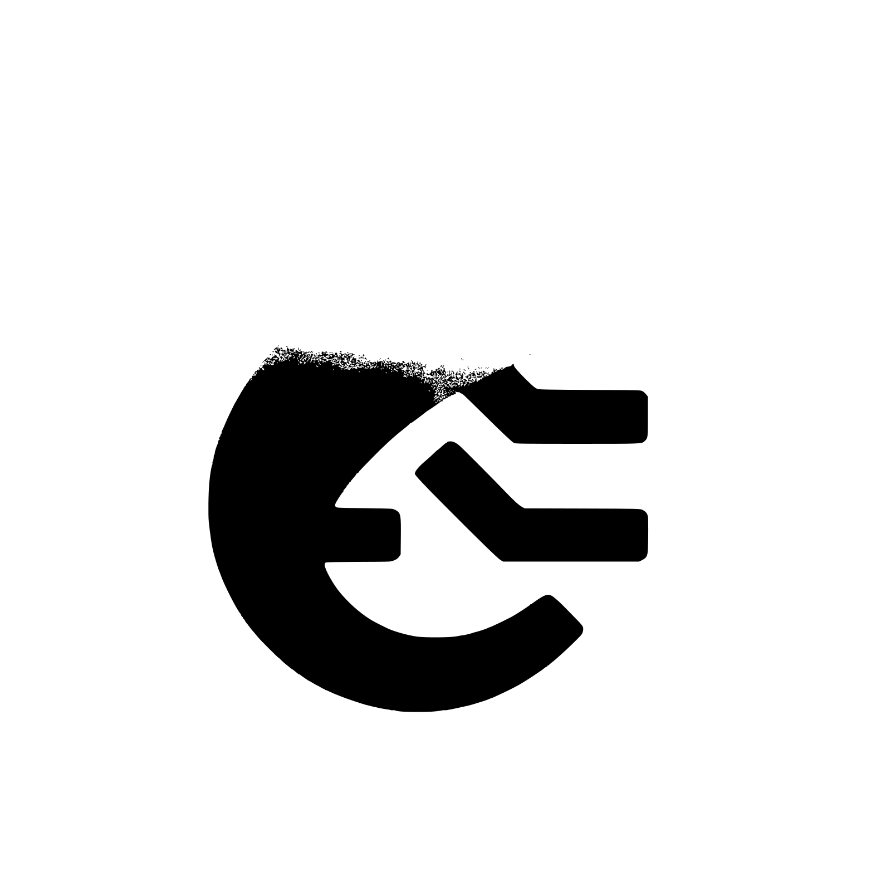

 

# triton

### A self sustaining growing neural net that can repair itself until reaching a desired accuracy

[](https://crates.io/crates/triton_grow)
[](https://docs.rs/triton_grow)

Triton aims to provide Keras level performance and ease of use to the world of Rust without being simply a wrapper library. Using Rust's unique traits system, Triton will enable more robust neural networks along with control over finer aspects that keras simply does not have. Using the build in Input trait, practically any data type can be mapped to an input for a neural network without the need for cutting corners, and the inner trait for layers allows for a plug and play style to neural network development. Currently, Triton has full support for Dense layers, Adam Optimization for Backprop, Activation functions (Sigmoid, TanH, ReLU and LeakyReLU), and even loss analysis per model and per layer.

One feature in development is that of self growing systems, allowing the neural network to analyze the loss of every layer and algorithmically deduce where the best place to splice in a new layer of a certain length would be. This feature was finalized in an earlier version of Triton, but is currently unavailable with the new rewrite currently taking place. Self growing neural networks is the main goal of the Triton crate, and is currently one of the highest priorities in development.

Currently, the other features in development for Triton are as follows: Convolutional layers(Forward is finished, working on backprop now), Flattening layers(goes hand in hand with convolutional backprop) and self growth systems. The future of Triton is unknown, but the goal would be to implement more layer types, with Recurrent layers likely being next and GAN support being a pipe dream for far into the future.

## Installation

Use the package manager [cargo](https://crates.io/) to add [triton](https://crates.io/crates/triton_grow) to your rust project.

```bash
cargo add triton_grow
```

or add the dependency directly in your **cargo.toml** file

```toml
[dependencies]
triton_grow = "{version}"
```
## Usage

### Dense Network
```rust
use triton_grow::network::{network::Network, activations::Activations, layer::layers::LayerTypes, input::Input};

fn main() {
    let inputs: Vec<Vec<f32>> = vec![vec![0.0,0.0],vec![1.0,0.0],vec![0.0,1.0], vec![1.0,1.0]];
    let outputs: Vec<Vec<f32>> = vec![vec![0.0],vec![1.0],vec![1.0], vec![0.0]];

    let mut new_net = Network::new(4);

    new_net.add_layer(LayerTypes::DENSE(2, Activations::SIGMOID, 0.1));
    new_net.add_layer(LayerTypes::DENSE(3, Activations::SIGMOID, 0.1));
    new_net.add_layer(LayerTypes::DENSE(1, Activations::SIGMOID, 0.1));

    new_net.compile();

    new_net.fit(&inputs, &outputs, 40);

    //let mut new_net = Network::load("best_network.json");
    println!("1 and 0: {:?}", new_net.predict(vec![1.0,0.0])[0]);
    println!("0 and 1: {:?}", new_net.predict(vec![0.0,1.0])[0]);
    println!("1 and 1: {:?}", new_net.predict(vec![1.0,1.0])[0]);
    println!("0 and 0: {:?}", new_net.predict(vec![0.0,0.0])[0]);

    new_net.save("best_network.json");
}
```
## Proven Results [Outdated as of Triton version 2.0, statistics will be updated upon completion of the new self growth algorithm]

Upon testing Triton's self growth method against a traditional preconfigured network model. Three neural networks were all tasked with learning a simple **XOR predictor** with the following inputs and outputs:

### Inputs
```
[ 1.0 , 0.0 ]
[ 0.0 , 1.0 ]
[ 0.0 , 0.0 ]
[ 1.0 , 1.0 ]
```

### Outputs
```
[ 1.0 ]
[ 1.0 ]
[ 0.0 ]
[ 0.0 ]
```

### Testing

| Model Name    | Layers {input -[hidden] - output} | Epochs Needed to Get 0.001 Avg Loss |
| ------------- | ------------- | ------------- |
| Minimum  | 2 - { *3* } - 1  |  7,880,000 |
| Well Fit  | 2 - { *3 - 4 - 3* } - 1 | 2,790,000  |
| Triton  | 2 - { *self growing* } - 1 | 100,000  |

Triton was 98.09% more efficient than the minimum fit model, and 94.62% more than even the well fit model.

### Data Visualization

Using the triton_grow::helper::data_vis extension, you can use the plotters library to visualize aspects of your neural network!

Currently the following visualizations exist:

- Loss history
- Error per layer

### Example

```rust
use std::error::Error;

use triton_grow::network::{network::Network, activations::Activations, layer::layers::LayerTypes, input::Input};
use triton_grow::helper::data_vis;

fn main() -> Result<(), Box<dyn Error>> {
    let inputs: Vec<Vec<f32>> = vec![vec![0.0,0.0],vec![1.0,0.0],vec![0.0,1.0], vec![1.0,1.0]];
    let outputs: Vec<Vec<f32>> = vec![vec![0.0],vec![1.0],vec![1.0], vec![0.0]];

    let mut new_net = Network::new(4);

    new_net.add_layer(LayerTypes::DENSE(2, Activations::SIGMOID, 0.1));
    new_net.add_layer(LayerTypes::DENSE(3, Activations::SIGMOID, 0.1));
    new_net.add_layer(LayerTypes::DENSE(1, Activations::SIGMOID, 0.1));

    new_net.compile();

    new_net.fit(&inputs, &outputs, 40);

    new_net.plot_loss_history("loss_history.png")?;
    new_net.plot_layer_loss("layer_loss.png")?;
    Ok(())
}
```

## TODO

Currently, triton is in a very beta stage, the following features are still in development:

[Growth Goals]
 - [ ]  Mutating a neural network
    - [ ]  Adding a new layer with ```n``` neurons into any point of an existent network
    - [ ]  Removing a layer from an existent network **!!IN PROGRESS!!**
- [ ]  Back propegation only affecting a single column (allows for a newly added layer to 'catch up')
- [X]  *Analysis* mode during back propegation allowing for all individual errors to be recorded
- [ ]  Updated training function
    - [ ]  Input desired success rate
    - [ ]  Dynamic error analysis to allow for choosing if the network should grow or shrink
    - [ ]  Acceptable threshold of +/- in the errors to allow for a less punishing learning process especially when a new neuron layer has been added
- [X]  Model serialization (serde)
- [ ] Accelerated matrix multiplication (Rayon or Cuda, or BOTH)

[Neural Network Goals]
- [X] Create abstract representation for layers (Layer trait)
    - [X] Dense
    - [ ] Convolutional
    - [ ] Recurrent
- [X] Allow for different activation functions and learning rates on each layer
- [X] Adam Optimization in backprop
- [X] Helper Function for parsing CSV data
- [X] Helper Function for generating the MNIST dataset
- [X] Helper Functions for generating and deriving categorical data

## License

[MIT](https://choosealicense.com/licenses/mit/)
